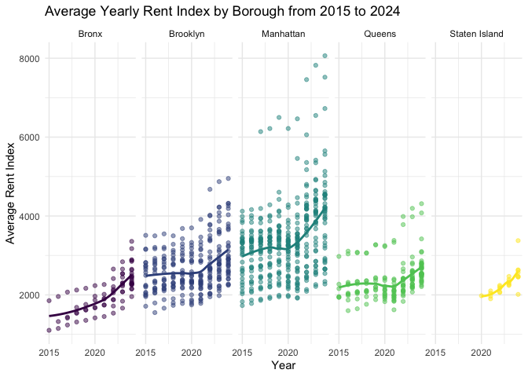
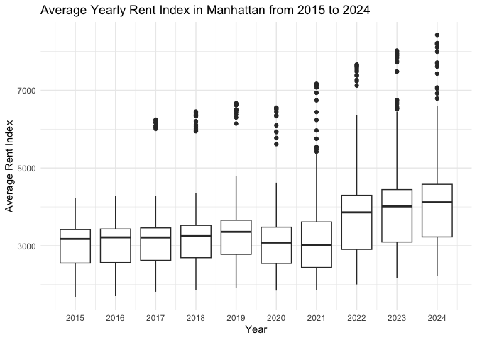
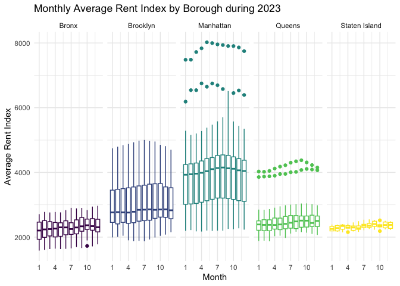
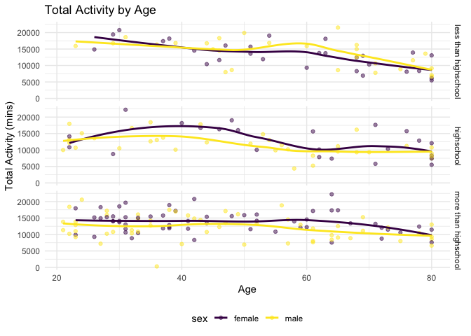

p8105_hw3_jg5038
================
Julia Gray
2025-10-02

# Problem 1

``` r
data("instacart")

instacart_df = instacart |> 
  janitor::clean_names()

#order_dow is given as an integer but to make it human readable let's change it to a string. We don't know which day is which but in order to find out we can see the distribution by day and assume that the most orders happen on Saturday and Sunday

instacart_df |> 
  group_by(order_dow) |> 
  summarize(n = n_distinct(order_id))
```

    ## # A tibble: 7 × 2
    ##   order_dow     n
    ##       <int> <int>
    ## 1         0 27465
    ## 2         1 19672
    ## 3         2 16119
    ## 4         3 15687
    ## 5         4 15959
    ## 6         5 17406
    ## 7         6 18901

``` r
#Let's assume that people order the most groceries on Monday so dow 0 = Monday

instacart_df = instacart_df |> 
  mutate(order_dow_string = 
         case_match(
           order_dow, 
           0 ~ "Mon", 
           1 ~ "Tues",
           2 ~ "Weds",
           3 ~ "Thurs", 
           4 ~ "Fri",
           5 ~ "Sat",
           6 ~ "Sun"
         ))
```

This dataset contains order information from instacart. It is organized
by order and contains information about the products ordered, as well as
information about the customer (i.e. how long it’s been since they last
ordered). It contains 1384617 observations and includes columns for
order_id, product_id, add_to_cart_order, reordered, user_id, eval_set,
order_number, order_dow, order_hour_of_day, days_since_prior_order,
product_name, aisle_id, department_id, aisle, department. For example,
the first order in the dataset was made by 112108 at 10 o clock and we
can see they ordered c(“Bulgarian Yogurt”, “Organic 4% Milk Fat Whole
Milk Cottage Cheese”, “Organic Celery Hearts”, “Cucumber Kirby”,
“Lightly Smoked Sardines in Olive Oil”, “Bag of Organic Bananas”,
“Organic Hass Avocado”, “Organic Whole String Cheese”) (of which
c(“Bulgarian Yogurt”, “Organic 4% Milk Fat Whole Milk Cottage Cheese”,
“Lightly Smoked Sardines in Olive Oil”, “Organic Whole String Cheese”)
were reordered).

There are 134 unique aisles. Here is a table of the aisles most ordered
from (just showing the top 10):

``` r
instacart_aisle_sum_df = instacart_df |> 
  group_by(aisle) |> 
  summarize(
    n = n()
  ) |> 
  arrange(desc(n)) 

instacart_aisle_sum_df |> 
  head(10) |> 
  knitr::kable()
```

| aisle                         |      n |
|:------------------------------|-------:|
| fresh vegetables              | 150609 |
| fresh fruits                  | 150473 |
| packaged vegetables fruits    |  78493 |
| yogurt                        |  55240 |
| packaged cheese               |  41699 |
| water seltzer sparkling water |  36617 |
| milk                          |  32644 |
| chips pretzels                |  31269 |
| soy lactosefree               |  26240 |
| bread                         |  23635 |

Now let’s plot aisles with more than 10,000 items ordered from them:

``` r
#UPDATE labels and size to render correctly
instacart_aisle_sum_df |> 
  filter(n >= 10000) |> 
  ggplot(aes(x=reorder(aisle, n), y=n)) +
  geom_bar(stat="identity") +
  coord_flip()
```


In order to find the most popular items for each aisle let’s group by:

``` r
instacart_aisle_item_df = instacart_df |> 
  group_by(aisle) |> 
  count(product_name) |> 
  mutate(
    item_aisle_rank = min_rank(desc(n))
    ) |> 
  filter(aisle %in% c('baking ingredients', 'dog food care', 'packaged vegetables fruits'), item_aisle_rank <= 3) |> 
  arrange(aisle, item_aisle_rank)

knitr::kable(instacart_aisle_item_df)
```

| aisle                      | product_name                                  |    n | item_aisle_rank |
|:---------------------------|:----------------------------------------------|-----:|----------------:|
| baking ingredients         | Light Brown Sugar                             |  499 |               1 |
| baking ingredients         | Pure Baking Soda                              |  387 |               2 |
| baking ingredients         | Cane Sugar                                    |  336 |               3 |
| dog food care              | Snack Sticks Chicken & Rice Recipe Dog Treats |   30 |               1 |
| dog food care              | Organix Chicken & Brown Rice Recipe           |   28 |               2 |
| dog food care              | Small Dog Biscuits                            |   26 |               3 |
| packaged vegetables fruits | Organic Baby Spinach                          | 9784 |               1 |
| packaged vegetables fruits | Organic Raspberries                           | 5546 |               2 |
| packaged vegetables fruits | Organic Blueberries                           | 4966 |               3 |

To make a table showing the mean hour per day at which items are ordered
for each day of the week we will group by day and calculate the mean:

``` r
instacart_df |> 
  filter(product_name %in% c('Pink Lady Apples', 'Coffee Ice Cream')) |> 
  group_by (product_name, order_dow_string) |> 
  summarize(
    mean_order_hour_of_day = round(mean(order_hour_of_day, na.rm = TRUE), digits=2)
  ) |> 
  pivot_wider(
    names_from = order_dow_string,
    values_from = mean_order_hour_of_day
  ) |> 
  select('product_name', 'Mon', 'Tues', 'Weds', 'Thurs', 'Fri', 'Sat', 'Sun') |> 
  knitr::kable()
```

    ## `summarise()` has grouped output by 'product_name'. You can override using the
    ## `.groups` argument.

| product_name     |   Mon |  Tues |  Weds | Thurs |   Fri |   Sat |   Sun |
|:-----------------|------:|------:|------:|------:|------:|------:|------:|
| Coffee Ice Cream | 13.77 | 14.32 | 15.38 | 15.32 | 15.22 | 12.26 | 13.83 |
| Pink Lady Apples | 13.44 | 11.36 | 11.70 | 14.25 | 11.55 | 12.78 | 11.94 |

# Problem 2

Import and tidy data

``` r
zip_df = read_csv(file="./data/zillow_data/Zip Codes.csv") |> 
  janitor::clean_names()
```

    ## Rows: 322 Columns: 7
    ## ── Column specification ────────────────────────────────────────────────────────
    ## Delimiter: ","
    ## chr (4): County, County Code, File Date, Neighborhood
    ## dbl (3): State FIPS, County FIPS, ZipCode
    ## 
    ## ℹ Use `spec()` to retrieve the full column specification for this data.
    ## ℹ Specify the column types or set `show_col_types = FALSE` to quiet this message.

``` r
rent_df = read_csv(file="./data/zillow_data/Zip_zori_uc_sfrcondomfr_sm_month_NYC.csv") |> 
  janitor::clean_names() |> 
  #update column names to match zip_df
  rename(
    zip_code = region_name,
    county = county_name) |> 
  mutate(
    county = str_replace(county, " County", ""),
    borough = 
      case_match(
        county, 
        "Bronx" ~ "Bronx", 
        "Kings" ~ "Brooklyn",
        "New York" ~ "Manhattan",
        "Queens" ~ "Queens", 
        "Richmond" ~ "Staten Island") 
  ) |> 
  pivot_longer(
    cols=x2015_01_31:x2024_08_31,
    names_to = "date",
    values_to="observed_rent_index"
  ) |> 
  mutate(
    #let's use the lubridate package
    date = ymd(str_replace(date, "x", "")),
    year = year(date),
    month = month(date)
  )
```

    ## Rows: 149 Columns: 125
    ## ── Column specification ────────────────────────────────────────────────────────
    ## Delimiter: ","
    ## chr   (6): RegionType, StateName, State, City, Metro, CountyName
    ## dbl (119): RegionID, SizeRank, RegionName, 2015-01-31, 2015-02-28, 2015-03-3...
    ## 
    ## ℹ Use `spec()` to retrieve the full column specification for this data.
    ## ℹ Specify the column types or set `show_col_types = FALSE` to quiet this message.

``` r
rent_zip_df = left_join(rent_df, zip_df, by = c("county", "zip_code")) |> 
  relocate("zip_code", "neighborhood",  "date", "observed_rent_index")
```

How many zipcodes are observed for all 116 months, how many observed
less than 10 times?

``` r
rent_zip_na = rent_zip_df |> 
  group_by(zip_code) |> 
  summarize(
    n_observations = sum(!is.na(observed_rent_index))
  )
```

There are 48 zipcodes with 116 observations and 26 with less than 10.
The zipcodes with 116 observations are popular residential districts and
the ones with less than 10 are mixed between residential and commercial
real estate (for example 10044 is Roosevelt Island).

``` r
rent_zip_df |> 
  group_by(borough, year) |> 
  summarize(
    average_rent_index = round(mean(observed_rent_index, na.rm = TRUE), digits=2)
  ) |> 
  pivot_wider(
    names_from = year,
    values_from = average_rent_index
  ) |> 
  knitr::kable()
```

    ## `summarise()` has grouped output by 'borough'. You can override using the
    ## `.groups` argument.

| borough       |    2015 |    2016 |    2017 |    2018 |    2019 |    2020 |    2021 |    2022 |    2023 |    2024 |
|:--------------|--------:|--------:|--------:|--------:|--------:|--------:|--------:|--------:|--------:|--------:|
| Bronx         | 1759.60 | 1520.19 | 1543.60 | 1639.43 | 1705.59 | 1811.44 | 1857.78 | 2054.27 | 2285.46 | 2496.90 |
| Brooklyn      | 2492.93 | 2520.36 | 2545.83 | 2547.29 | 2630.50 | 2555.05 | 2549.89 | 2868.20 | 3015.18 | 3126.80 |
| Manhattan     | 3022.04 | 3038.82 | 3133.85 | 3183.70 | 3310.41 | 3106.52 | 3136.63 | 3778.37 | 3932.61 | 4078.44 |
| Queens        | 2214.71 | 2271.96 | 2263.30 | 2291.92 | 2387.82 | 2315.63 | 2210.79 | 2406.04 | 2561.62 | 2694.02 |
| Staten Island |     NaN |     NaN |     NaN |     NaN |     NaN | 1977.61 | 2045.43 | 2147.44 | 2332.93 | 2536.44 |

Unsurprisingly, Manhattan has the highest average rent index. There is
no data for Staten Island prior to 2020. We can see the decrease caused
by COVID across the other bouroughs.

``` r
year_rent_graph = rent_zip_df |> 
  group_by(zip_code, borough, year) |> 
  summarize(
    average_rent_index = round(mean(observed_rent_index, na.rm = TRUE), digits=2)
  ) |> 
  ggplot(aes(x = year, y=average_rent_index, color=borough)) + 
  geom_point(alpha = 0.5) +
  geom_smooth(se = FALSE) + 
  #geom_boxplot()
  facet_grid(. ~ borough)
```

    ## `summarise()` has grouped output by 'zip_code', 'borough'. You can override
    ## using the `.groups` argument.

``` r
year_rent_graph
```

    ## `geom_smooth()` using method = 'loess' and formula = 'y ~ x'

    ## Warning: Removed 531 rows containing non-finite outside the scale range
    ## (`stat_smooth()`).

    ## Warning in simpleLoess(y, x, w, span, degree = degree, parametric = parametric,
    ## : pseudoinverse used at 2024

    ## Warning in simpleLoess(y, x, w, span, degree = degree, parametric = parametric,
    ## : neighborhood radius 2.02

    ## Warning in simpleLoess(y, x, w, span, degree = degree, parametric = parametric,
    ## : reciprocal condition number 6.0562e-17

    ## Warning in simpleLoess(y, x, w, span, degree = degree, parametric = parametric,
    ## : There are other near singularities as well. 1

    ## Warning: Removed 531 rows containing missing values or values outside the scale range
    ## (`geom_point()`).


We can see Manhattan, in addition to having the highest average rent
index, has the highest variance among all boroughs.

Let’s see some boxplots for Manhattan for fun:

``` r
rent_zip_df |> 
  filter(borough == 'Manhattan') |> 
  group_by(zip_code, year) |> 
  ggplot(aes(x = year, y=observed_rent_index, group = year)) +
  geom_boxplot()
```

    ## Warning: Removed 628 rows containing non-finite outside the scale range
    ## (`stat_boxplot()`).



``` r
#since each row is already 1 zipcode per month there is nothing to average, it will just be the rent index in the row. We can confirm this because when we calculate the mean it is the same as if we just filtered and grouped by (since the n is 1).
month_rent_graph = rent_zip_df |>
  filter(year == 2023) |> 
  group_by(zip_code, borough, month) |> 
  summarize(
    average_rent_index = round(mean(observed_rent_index, na.rm = TRUE), digits=2)
  ) |> 
  ggplot(aes(x = month, y=average_rent_index, color=borough, group=month)) +
  #geom_point() +
  geom_boxplot() +
  facet_grid(. ~ borough)
```

    ## `summarise()` has grouped output by 'zip_code', 'borough'. You can override
    ## using the `.groups` argument.

``` r
month_rent_graph
```

    ## Warning: Removed 333 rows containing non-finite outside the scale range
    ## (`stat_boxplot()`).



Combine the two graphs:

``` r
year_rent_graph / month_rent_graph + plot_layout(guide="collect")
```

    ## `geom_smooth()` using method = 'loess' and formula = 'y ~ x'

    ## Warning: Removed 531 rows containing non-finite outside the scale range
    ## (`stat_smooth()`).

    ## Warning in simpleLoess(y, x, w, span, degree = degree, parametric = parametric,
    ## : pseudoinverse used at 2024

    ## Warning in simpleLoess(y, x, w, span, degree = degree, parametric = parametric,
    ## : neighborhood radius 2.02

    ## Warning in simpleLoess(y, x, w, span, degree = degree, parametric = parametric,
    ## : reciprocal condition number 6.0562e-17

    ## Warning in simpleLoess(y, x, w, span, degree = degree, parametric = parametric,
    ## : There are other near singularities as well. 1

    ## Warning: Removed 531 rows containing missing values or values outside the scale range
    ## (`geom_point()`).

    ## Warning: Removed 333 rows containing non-finite outside the scale range
    ## (`stat_boxplot()`).



``` r
ggsave('plots/zillow_rent_index_by_borough.pdf')
```

    ## Saving 6 x 3.6 in image
    ## `geom_smooth()` using method = 'loess' and formula = 'y ~ x'

    ## Warning: Removed 531 rows containing non-finite outside the scale range
    ## (`stat_smooth()`).

    ## Warning in simpleLoess(y, x, w, span, degree = degree, parametric = parametric,
    ## : pseudoinverse used at 2024

    ## Warning in simpleLoess(y, x, w, span, degree = degree, parametric = parametric,
    ## : neighborhood radius 2.02

    ## Warning in simpleLoess(y, x, w, span, degree = degree, parametric = parametric,
    ## : reciprocal condition number 6.0562e-17

    ## Warning in simpleLoess(y, x, w, span, degree = degree, parametric = parametric,
    ## : There are other near singularities as well. 1

    ## Warning: Removed 531 rows containing missing values or values outside the scale range
    ## (`geom_point()`).

    ## Warning: Removed 333 rows containing non-finite outside the scale range
    ## (`stat_boxplot()`).

# Problem 3

Load, tidy, merge the dataset

``` r
accel_df = read.csv('./data/nhanes/nhanes_accel.csv') |> 
  janitor::clean_names() |> 
  #use colnames(accel_df)[ncol(accel_df)] to get last colname
  pivot_longer(
    cols=min1:min1440,
    names_to = "min",
    #names_prefix("min"),
    values_to="MIMS"
  ) |> 
  mutate (
    min = as.integer(str_remove(min, "min"))
  )

#sex: 2 = female
#education: 1 = less than highschool, 2 = high school, 3 = more than highschool
covar_df = read.csv('./data/nhanes/nhanes_covar.csv', skip = 4) |> 
  #let's exlcude participants under 21, or missing demographic data before we merge
  janitor::clean_names() |> 
  filter(age >= 21, !is.na(sex), !is.na(bmi), !is.na(education)) |> 
  mutate(
    sex = case_match(
      sex, 
      1 ~ "male",
      2 ~ "female"
    ),
    education_string = case_match(
      education,
      1 ~ "less than highschool",
      2 ~ "highschool",
      3 ~ "more than highschool"
    )
  )

nhanes_df = left_join(covar_df, accel_df, by="seqn")
```

Let’s produce a reader-friendly table for the number of men and women in
each education category

``` r
nhanes_df |> 
  group_by(sex, education_string) |> 
  summarize(
    n = n_distinct(seqn)
  ) |> 
  pivot_wider(
    names_from = education_string,
    values_from = n
  ) |> 
  select(sex, `less than highschool`, `highschool`, `more than highschool`) |>  
  knitr::kable()
```

    ## `summarise()` has grouped output by 'sex'. You can override using the `.groups`
    ## argument.

| sex    | less than highschool | highschool | more than highschool |
|:-------|---------------------:|-----------:|---------------------:|
| female |                   28 |         23 |                   59 |
| male   |                   27 |         35 |                   56 |

Create vizualization of age distribution for men and women in each age
category

``` r
#change to demographic data

nhanes_df |> 
  select(seqn, sex, age, education) |> 
  distinct() |> 
  #summarize(
  #  n = n_distinct()
  #) |> 
  ggplot(aes(x=age, color=sex)) +
  geom_histogram(aes(fill=sex), binwidth=5) +
  facet_grid(sex ~ education)
```


``` r
#covar_df |> 
#  ggplot(aes(x=age, color=sex)) +
#  geom_histogram(aes(fill=sex), binwidth=5) +
#  facet_grid(sex ~ education)

#covar_df |> 
#  ggplot(aes(x=age, color=sex)) +
#  geom_histogram(aes(fill=sex), binwidth=5)+
#  facet_grid(sex~education)
```

Comment

Traditional analyses of accelerometer data focus on the total activity
over the day. Using your tidied dataset, aggregate across minutes to
create a total activity variable for each participant. Plot these total
activities (y-axis) against age (x-axis); your plot should compare men
to women and have separate panels for each education level. Include a
trend line or a smooth to illustrate differences. Comment on your plot.

Let’s make sure we’re getting all participants:

``` r
#length(unique(select(nhanes_df, seqn)))
length(unique(nhanes_df$seqn))
```

    ## [1] 228

``` r
nhanes_df |> 
  group_by(seqn, sex, age, education_string) |> 
  summarize(
    total_activity = sum(MIMS)
  ) |> 
  ggplot(aes(x=age, y=total_activity, color=sex)) +
  geom_point(alpha = 0.5) +
  geom_smooth(se = FALSE) +
  facet_grid(education_string ~ .)
```

    ## `summarise()` has grouped output by 'seqn', 'sex', 'age'. You can override
    ## using the `.groups` argument.
    ## `geom_smooth()` using method = 'loess' and formula = 'y ~ x'


Comment

``` r
nhanes_df |> 
  #let's start with just one person
  filter(seqn==62161) |> 
  #select(min) |> 
  #range()
  ggplot(aes(x=min, y=MIMS)) +
  geom_point()
```



``` r
nhanes_df |> 
  group_by(min, sex, education_string) |> 
  summarize(
    mean_mims = mean(MIMS, na.rm = TRUE),
    median_mims = median(MIMS, na.rm = TRUE)
  ) |> 
  ggplot(aes(x=min, y=median_mims, color=sex)) +
  geom_point(alpha = 0.5) +
  geom_smooth(se=FALSE) +
  facet_grid(factor(education_string, levels=c('less than highschool','highschool','more than highschool')) ~ .)
```

    ## `summarise()` has grouped output by 'min', 'sex'. You can override using the
    ## `.groups` argument.
    ## `geom_smooth()` using method = 'gam' and formula = 'y ~ s(x, bs = "cs")'


